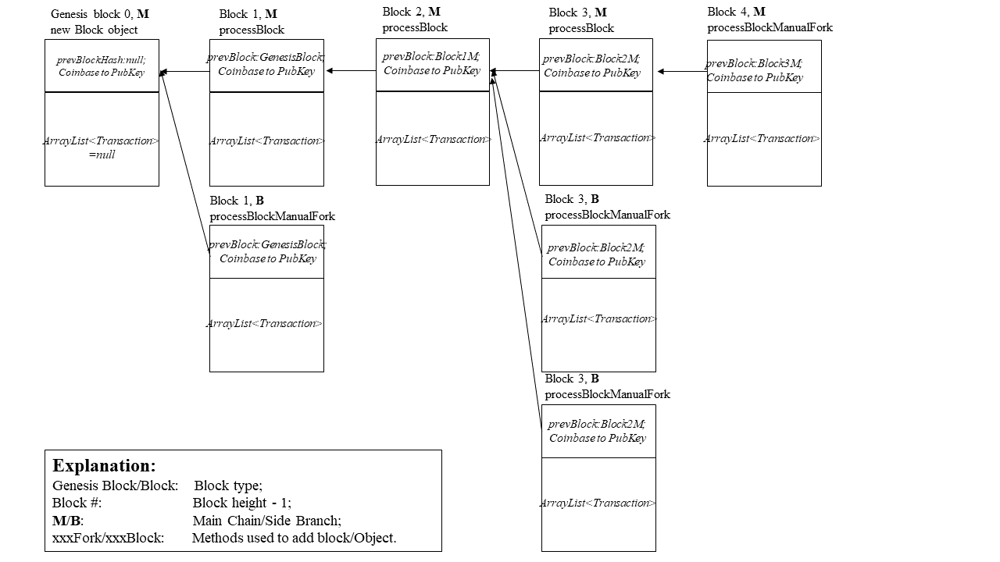

# Block Chain
This assignment is to build a petty blcok chain, where no actual distributed consensus mechanism is introduced(though simulated). There will be 2 parts, the 1st part is about how this petty block chain works while the 2nd part is about the test cases and corresponding explanation.

**Content**

[Mechanism](#1-.-Mechanism)

[Init a new transaction](#How-to-init-a-new-transaction-for-a-block)

[Init a new block](#How-to-create-a-new-block)

[Create a block chain(codes)](#How-petty-block-chain-are-realized-(-Code-fashion-))

[Store a clip of block chain](#Avoid-overflow)

[Outputs example in test case](#Outputs-(-each-block-)-in-test-case)

[Test case: A valid block chain and store limited length of block chain](#Test_case_1)

[Test case: illegal coinbase](#Test-case-2)

[Test case: illegal manual fork](#Test-case-3)

[Test case: illegal previous block hash](#Test-case-4)

## 1.Mechanism
The block chain in this assignment is organized in a tree, every block is enclosed in a node and transations in each node is stored in a list instead of a Merkle tree. To be specific, each block and its block node contains following components:

```java
public class Block{
  public static final int COINBASE = 25
  private byte[] prevBlockHash;
  private Transaction coinbase;
  private ArrayList<Transaction> txs;
  
  /**this is a constructor*/
  private Block(byte[] prevBlockHash, PublicKey address){
    this.prevBlockHash = prevBlockHash;
    this.coinbase = new Transaction(COINBASE, address);
    this.txs = new ArrayList<Transactions>();
  }
}

public class BlockNode{
  private UTXOPool utxoPool;
  private Block block;
  private BlockNode parentNode;
  private ArrayList<BlockNode> childNodes;
  private int height;
  
  /**This is a constructor*/
  private BlockNode(Block block){
    this.block = block;
    this.utxoPool = new UTXOPool();
    this.parentNode = new BlockNode();
    this.childNodes = new ArrayList<BlockNode>();
    this.height = height;
  }
}
```

When block chain are constructed, they're connected with *BlockNode* object, thus, it must been ensured that ```parentNode.block.getHash()``` is equal to ```prevBlockHash```; and all ```Transaction``` object in ```ArrayList<Transaction>``` are valid, this is realized by the ```TxHandler(UTXOPool)``` class in **ScroogeCoin**.

Common rules here is different that of Bitcoin's block chain, including:
1. COINBASE can be used immediately in the next valid block;
2. Can not specify *Tx* to be included in a block, all valid transactions will be included in the most recent available block.

Especially, when forking, the following rules are applied:
1. Default adding block will be attached to the longest side branch;
2. Manual forking allows users to make a new fork appended to any block whose height is not smaller than *height of current longest side branch - 10*;
3. When a fork has same-length side branches, the longest side branch is the oldest one(here realized by BFS);
4. Since only one global transaction pool is maintained, thus forking may produce irreversable changes;
5. Only one genesis block(means previous block's hash is *null*) can exist in one block chain.

## 2.Test cases and further explanation
In test cases, to make life simple, "Manual forking allows users to make a new fork appended to any block whose height is not smaller than *height of current longest side branch - 2*;".

Since different situations of corrupted transactions have been discussed in **ScroogeCoin**'s test cases, here they won't be discussed. Additionally, to make each test case clarify themselves, the following result are printed, including:
1. Hash of block existing in block chain are printed;
2. Hash of all intended block(no matter add successfully or not) are printed;
3. To show whether transaction pool works or not, examples are introduced, but the hash of transations in transaction pool won't always be printed out;
4. If the test case is about UTXO pool, UTXO pool will be presented.

### How to init a new transaction for a block

There're 2 ways to let the block accept your transaction:

**Wrap transaction to block directly**(recommended), use ```Block.addTransaction()```

**Add transaction to the global transaction pool**(risky, may produce transaction used in a side branch, not reversible), use ```BlockChain.addTransaction()``` or ```BlockHandler.processTx()```.However, if the program is presented in an API, only operations in ```BlockHandler``` will be feasible for users.

### How to create a new block

There're 2 ways to create a valid block, they are:

**Automatic Forking**: create a new block attached to the leaf node of the longest side branch, transactions can either be collected from transaction pool(``` BlockHandler.createBlock```) or be collected from the block's transaction array list(```BlockHandler.processBlock```);

**Manual Forking**: create a new block not attached to the leaf node of the longest side branch, similarly, 2 methods ```BlockHandler.createBlockManualFork```,```BlockHandler.processBlockManualFork``` are provided.

### How petty block chain are realized(Code-fashion)

The following ways are used to create a test case:

```java
// Attention: this is not real code, modify the @param
// init a new block chain with a genesis block
Block genesisBlock = new Block(prevBlockHash:null, coinbaseReceiverAddress:PubKey);
genesisBlock.finalize(); // init block's hash

BlockChain blockChain = new BlockChain(genesisBlock);
BlockHandler blockHandle = new BlockHandler(blockChain);

// add block--select parent block and collect transactions manually
Block blockPetty = new Block(prevBlockHash:byte[] block.getHash(), PubKey);
blockPetty.addTransaction(Transaction); // collect transactions manully
blockPetty.finalize(); // init block's hash

blockHandler.processBlockManualFork(Block:blockPetty,int goBackHeight);
```

### Avoid overflow
Use a special ```BlockChainClip``` class to store a little part of the block chain:
```java
public class BlockChainClip {
    //...
    public BlockChainClip(BlockChain.BlockNode blockNode){
        this.block = blockNode.getNode_block();
        this.height = blockNode.getNode_height();
        this.utxoPool = blockNode.getNode_UTXOPool();
        this.parentNode = blockNode.getNode_parentNode();
        this.childNodes = blockNode.getNode_childNodes();
        this.blockNode = blockNode;
    }

    public void printBlockChainClip(){...}

    private void printDFSSearch(BlockChain.BlockNode blockNode){...}
        
    //...
}
```


### Outputs(each block) in test case

Outputs will include:

```
for each block, print the following attributes:
0. The number of child nodes of current node's parent node;
1. The height of the block;
2. The hash code of the block;
3. The #Txs in the global Tx pool;
4. The #UTXOs in the block's utxo Pool.
```

### Test case 1
**A valid block chain and store limited length of block chain**

Description: the following feature will be verified in this test case:
1. The block chain can produce forks when these forks are legal;
2. Coinbase transaction can be consumed in the next coming block;
3. One can add valid block to valid positions of the block chain with either **Automatic Forking** or **Manual Forking**;
4. The longest side branch can be selected automatically;
5. Can only store a small part of the block chain to avoid overflow.

Test case description:



Test case explanation:

1. Add *genesis block 0*, a valid block, ```prevTxHash```=null; ```ArrayList<Transaction>```=null;
   + 1 Coinbase transaction is added to ```BlockChain.globalTxPool```;(total is 1)
   + 1 ```UTXO``` is added to ```BlockNode.utxoPool```;(total is 1)
2. Fork at the *genesis block 0*--*Block 1,**M*** and *Block 1,**B*** separately, test the structure of tree and test the Coinbase transaction can be used in both blocks; This is a **feature** in this design, ```BlockNode.utxoPool``` is stored independently in each block node, thus for both *Block 1,**M*** and *Block 1,**B***, Coinbase transaction of *genesis block 0* is available.
3. A limited length of block chain is stored in a new object ```BlockChainClip```

### Test case 2
**Illegal coinbase**

Description: 
1. try to consume an excessed coinbase number; since other invalid transactions has been tested in the **ScroogeCoin**, they won't be tested again here; 
3. create a block trying to use current block's coinbase in current block.

### Test case 3
**Illegal manual fork**

Description: try to create a fork on the block whose height is smaller than *maxHeight - CUT_OFF_AGE*,the CUT_OFF_AGE is reset to be 2 for convenience.

### Tets case 4
**Illegal previous block hash**

Description: 
1. insert a new genesis block when there exists a genesis block in the block chain;
2. incorrect previous hash when using automatic forking.

### Results


