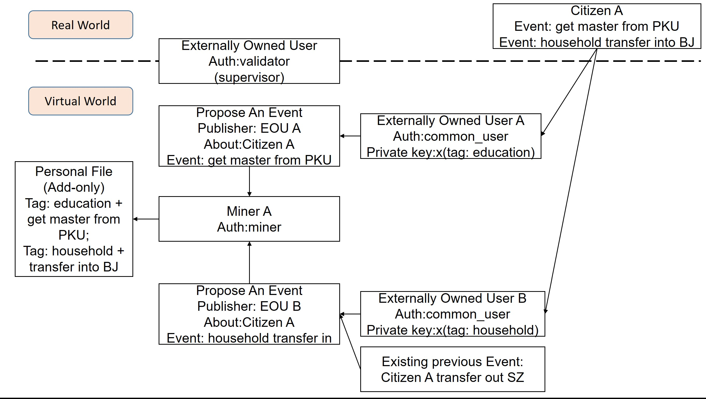
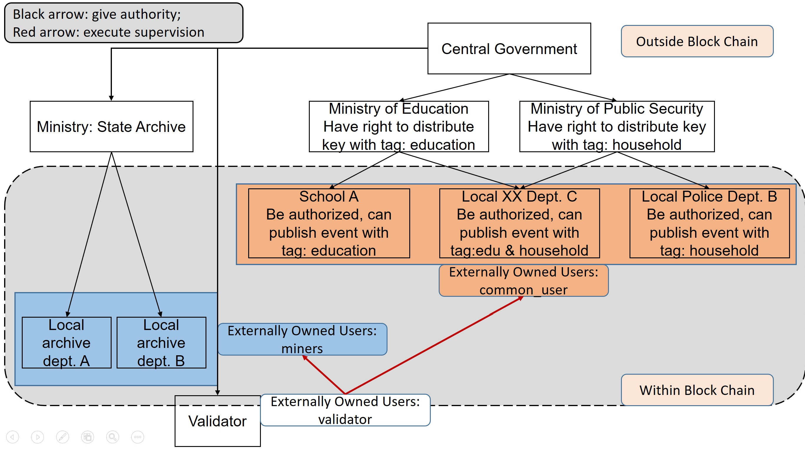

# Personal File System via Block Chain
@author: Jiaxi Ren & Zhangjie Lyu
*Please note: this is more like an abstract instead of a final version of report.*

**Content table**

+ What's personal file system?
+ What's existing problem?
+ Why block chain?
+ Design of block chain(architecture)

**IMPORTANT: if you feel the text is too long here, please jump to the end for some figures :)**

## What's personal file system

Personal file system, which indicates "个人档案" in Chinese, is an official record of crucial personal information in China. 

Content included in someone's personal files covers household, education, career information, criminal record etc.

## What are existing problems?

Existing system: a mixture of paper form and centralized data base(with distributed terminals).

**Major problems** in short:

+ low cost to manipulate existing information(e.g. fake diploma information);
+ regional restriction(e.g. consume long time to transmit personal file; denial to transmit personal file intentionally);
+ department restriction(e.g. citizen need multiple runs to several departments to make one thing happen);
+ conflicting records;
+ for paper form, cannot verify authenticity even been found after get lost.

## Why block chain?

Short answer:

+ immutable, authentic record;
+ cannot be double spent;
+ can be accessible all over the network;
+ one party cannot control the network(suppose no 51% attack);
+ history traceable;

where some features are evitable but cannot be realized even through a centralized data base/distributed data base system.

## Design of p-chain

The design on **application layer**. On this layer, design learns a lot from Ethereum. However, the differences are still significant.

### Characteristics of p-chain

Compared to common features of block chain, p-chain is:

1. real-name based;
2. in most cases, no malicious nodes;
3. network layer can be optimized(since the topological structure is deterministic);
4. not all parts of information are viewable to every node, authorization is required;
5. all irregular transaction(double-spending etc.) should be validated offline by validator.

### Roles in block chain

Unlike existing block chain, which has 2 major roles, miners and common users. The personal file system chain("p-chain" for short) has more roles, they are:

**miners**

miners are authorized institute user, including local personnel administration department, administration department on a province or higher level. They pack and mine a new block through mechanism of POS/DPOS(or other mechanism like PBFT). 

**common users**

common users are subordinate to miners, including universities or other institute that are qualified to transmit or modify part of these personal file information, they upload information for miners to pack.

**validator**

Validator are responsible for checking transactions uploaded by users. Also the transactions processed by miners are supervised. Validators' work involves both online and offline part.

**external users**

Citizens. With the relatively lowest authority, can only send request to view authorized part of information.

### Example: record an event

### Example: structure of roles' relationship

