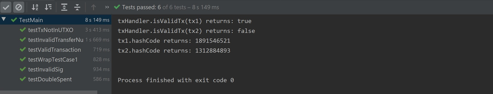

# Scrooge Coin

Scrooge Coin is a ledger held by every user. The coin itself is recorded by transaction, there're 2 types of transaction: one is *CreateCoins*, the other is *PayCoins*. 

## Intro. to Test case

The test cases are included in a file named *TestMain.java*. You can run each test case through clicking the triangle sign near *@Test*.

**FYI**, the number of transactions are also asserted. 

```java
assertTrue("tx1:One invalid transaction", txHandler.handleTxs(new Transaction[]{tx1}).length == 0);

assertTrue("tx1:One valid transaction", txHandler.handleTxs(new Transaction[]{tx1}).length == 1);

assertTrue("tx1:Four invalid transaction", txHandler.handleTxs(new Transaction[]{tx1,tx2,tx3,tx4}).length == 4);
```


**Table of Contents**

[1.A Valid Transaction](#1-.-A-Valid-Transaction)

[2.Double-spending](#2-.-Double-spending)

[3.Transaction not in UTXO](#3-.-Transaction-not-in-UTXO)

[4.Invalid signature](#4-.-Invalid-signature)

[5.Invalid output number](#5-.-Invalid-output-number)

[6.Process an unordered array of transactions in one time](#6-.-Process-an-unordered-array-in-one-time)


### Test cases

#### 1.A Valid Transaction

**Function Names**:

```java
public void testValidTransaction()
```

**Case**:

```R
tx0: Scrooge --> Scrooge 25coins [Create Coins]
tx1: Scrooge --> Scrooge 4coins  [Divide Coins]
     Scrooge --> Scrooge 5coins
     Scrooge --> Scrooge 6coins  
tx2: Scrooge --> Alice   4coins  [Pay seperately]
     Scrooge --> Alice   5coins
     Scrooge --> Bob     6coins
tx3: Alice --> Alice     2coins  [Divide Coins]
     Alice --> Alice     2coins
tx4: Alice --> Bob       2coins  [Pay jointly]
     Alice --> Bob       5coins
```

**Return**:

tx1, tx2, tx3, tx4are valid(*true*); return their transaction hash code.

**Assertion**

```java
assertTrue("tx1:Three UTXO's are created", utxoPool.getAllUTXO().size() == 3);

assertTrue("tx2:Three UTXO's are created", utxoPool.getAllUTXO().size() == 3);

//utxo from tx2: scrooge to alice(5);scrooge to bob(6);
//utxo from tx3: alice to alice(2);alice to alice(2);
assertTrue("tx3:Two UTXO's are created", utxoPool.getAllUTXO().size() == 4);

//utxo from tx4: alice to bob(7);
//utxo from tx3: alice to alice(2); scrooge to bob(6)
assertTrue("tx4:Two UTXO's are created", utxoPool.getAllUTXO().size() == 3);
```


#### 2.Double-spending

**Function Name**: *testDoubleSpent*

```java
public void testDoubleSpent() 
```

**Case**:

```R
tx0: Scrooge --> Scrooge 25coins [Create Coins]
tx1: Scrooge --> Alice   20coins [Pay Coins]
tx2: Scrooge --> Bob     20coins [*Double-spending*]
```

**Return**:

tx1(*true*), tx2(*false*); return their transaction hash code.

**Assertion**

```java
assertTrue("tx1: one UTXO's created.", utxoPool.getAllUTXO().size() == 1);

assertTrue("tx2:no UTXO's created.", utxoPool.getAllUTXO().size() == 1);
```


#### 3.Transaction not in UTXO:

**Function Name**: *testTxNotInUTXOPool*

```java
public void testInvalidTransferNumber()
```

**Case**:

```R
tx0: Scrooge --> Scrooge 25coins [Create Coins]
tx1: Scrooge --> Alice   20coins [Pay Coins *NOT added to UTXO pool* due to accidents]
tx2: Alice --> Bob       15coins [Pay Coins *Previous Tx NOT in UTXO pool*]       
```

**Return**:

tx1(*true*),tx2(*false*);return their transaction hash code.

**Assertion**:

```java
// tx1
utxoPool.removeUTXO(utxo);
assertTrue("tx1:UTXO has been removed.", utxoPool.getAllUTXO().size() == 0);

// tx2
assertTrue("tx2:no UTXO's created.", utxoPool.getAllUTXO().size() == 0);
```


#### 4.Invalid signature

**Function Name**: *testInvalidTransferNumber*

```java
public void testInvalidTransferNumber()
```

**Case**:

```R
tx0: Scrooge --> Scrooge 25coins [Create Coins]
tx1: Scrooge --> Alice   20coins [Pay Coins]
tx2: Alice --> Bob       20coins [*Signed by Bob*]
```

**Return**：

tx1(*true*),tx2(*false*); return their transaction hash code.

**Assertion**: 

```java
assertTrue("tx1:one UTXO's created.", utxoPool.getAllUTXO().size() == 1);

assertTrue("tx2:one UTXO's remained.", utxoPool.getAllUTXO().size() == 1);
```


#### 5.Invalid output number

**Function Name**: *testInvalidTransferNumber*

```java
public void testInvalidTransferNumber()
```

**Case**:

```R
tx0: Scrooge --> Scrooge 25coins [Create Coins]
tx1: Scrooge --> Alice   20coins [Pay Coins]
tx2: Alice --> Bob       -5coins [*Invalid output number*]
tx3: Alice --> Bob       90coins [*Invalid output number*]
```

**Return**:

tx1(*true*);tx2(*false*);tx3(*false*);return their transaction hash code.

**Assertion**:

```java
assertTrue("tx2:one UTXO's remained", utxoPool.getAllUTXO().size() == 1);

assertTrue("tx3:one UTXO's remained", utxoPool.getAllUTXO().size() == 1);
```


#### 6.Process an unordered array in one time

This function will process transaction in [test case1](#1.A-Valid-Transaction) in one time.

**Function Name**: *testWrapTestCase1*

```java
public void testWrapTestCase1()
```

**Case**:

```R
tx0: Scrooge --> Scrooge 25coins [Create Coins]

// wrap an unordered array
tx1: Scrooge --> Scrooge 4coins  [Divide Coins]
     Scrooge --> Scrooge 5coins
     Scrooge --> Scrooge 6coins  
tx2: Scrooge --> Alice   4coins  [Pay seperately]
	 Scrooge --> Alice   5coins
     Scrooge --> Bob     6coins
tx3: Alice --> Alice     2coins  [Divide Coins]
     Alice --> Alice     2coins
tx4: Alice --> Bob       2coins  [Pay jointly]
     Alice --> Bob       5coins
```

**Return**:

return their transaction hash code.

**Assertion**:

```java
assertTrue("tx1,2,3,4: four valid transaction", txHandler.handleTxs(new Transaction[]{tx1,tx2,tx3,tx4}).length == 4);

assertTrue("tx1,2,3,4:Two UTXO's are left", utxoPool.getAllUTXO().size() == 3);
```


### Test result

*All test cases passed.*



